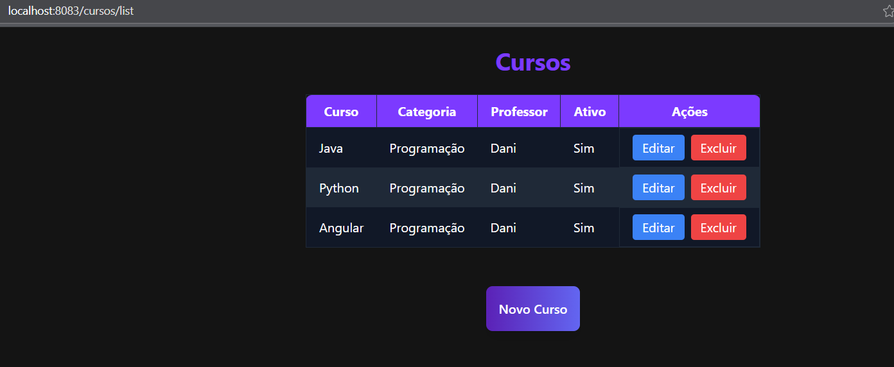
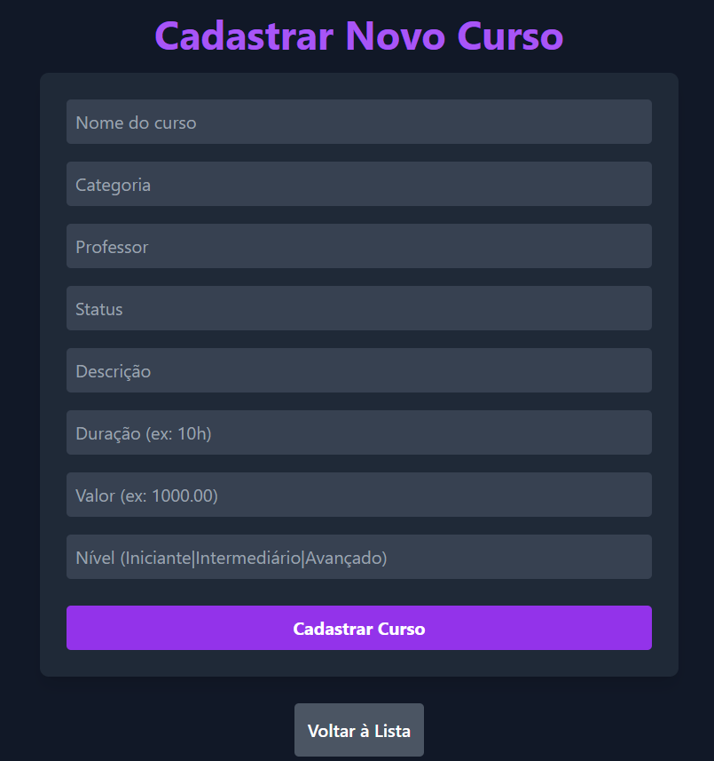
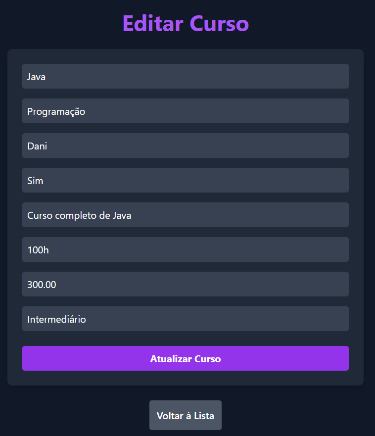

# 🛠️ Desafio Rocketseat: API RESTful com CRUD Completo

Este projeto consiste na construção de uma API RESTful utilizando **Java com Spring Boot**, **JPA** e **PostgreSQL** (Dbeaver). Ele implementa as operações completas de **CRUD (Create, Read, Update, Delete)**
em uma estrutura **MVC**, além de aplicar o padrão **DTO** para transferência de dados entre as camadas e utilizar a biblioteca **ModelMapper** para facilitar o mapeamento entre entidades e DTOs.

---

## 🚀 Tecnologias Utilizadas

## Linguagem
- Java 17+

## Banco de dados
- PostgreSQL 
- Dbeaver

## Framework
- Spring Boot
- Maven
 
## Dependêcias
- Spring Data JPA
- ModelMapper
- Spring Actuator
- Spring Web
- Spring DevTools
- Spring Validation
- PostgreSql

## PlugIn
  - Lombok

## Documentação e teste
  - Swagger
  

## Front-end 100% funcional
 - cursos/list

- cursos/create

  
- cursos/editar/id

  

---

  ## ✍️ Autor

**Felipe Rocha**  
  

